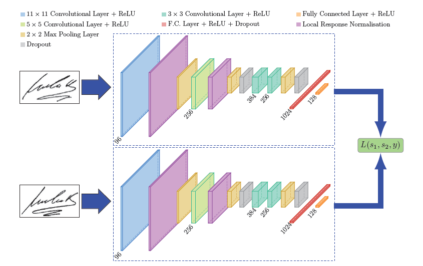

### SiamNetSignature: Signature Verification using Siamese Networks

### Overview
SiamNetSignature is a deep learning project that aims to solve the problem of signature verification using Siamese networks. A Siamese network is a neural network architecture specifically designed to determine the similarity between two input samples. This capability makes it ideal for tasks like signature verification, where the goal is to determine if two signatures belong to the same person or if they are forgeries.

#### What is Signature Verification?
Signature verification is a process used to confirm the authenticity of a signature by comparing it with a known valid signature. It is widely used in financial institutions, legal systems, and access control systems. The challenge lies in accurately distinguishing between genuine signatures and forgeries, which can vary due to natural variations in handwriting.

##### Why Siamese Networks?
Siamese networks are particularly well-suited for signature verification because they:

Learn to measure the similarity between pairs of inputs.
Are effective in scenarios where the problem involves comparing two samples rather than classifying a single sample.
Require fewer training samples of each class compared to traditional classification networks, which is crucial for signature verification where labeled data can be scarce.
Core Technology
The SiamNetSignature project leverages the following core technologies:

#### Siamese Neural Network Architecture:

Two identical subnetworks process two input images (signatures).
Each subnetwork extracts features from the input signature.
The network measures the distance between the two feature vectors to determine the similarity.

#### TensorFlow and Keras:

The project is implemented using TensorFlow and Keras, popular libraries for building and training neural networks.
These frameworks provide robust support for defining and training complex models, such as Siamese networks.
Contrastive Loss Function:

The training process uses a contrastive loss function.
This loss function minimizes the distance between genuine signature pairs and maximizes the distance between forgery pairs.
Dataset Handling and Preprocessing:

Includes tools for loading and preprocessing signature datasets.
Handles variations in signature images, such as different sizes and orientations.

#### Repository Structure
The repository is organized to facilitate easy navigation and understanding of the codebase. Here’s a breakdown of the main components:

##### datasets/: Contains scripts and tools for downloading, preparing, and managing signature datasets.

